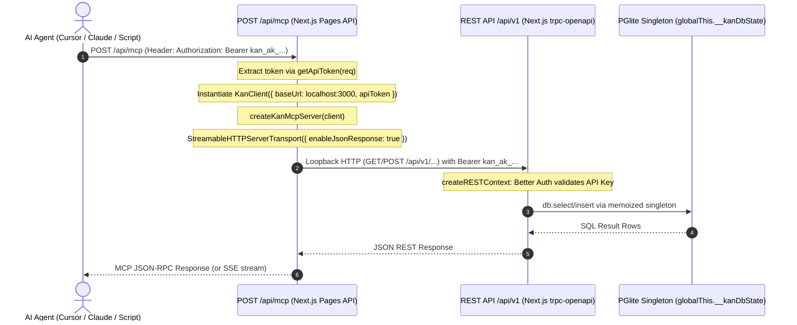

# Kan Hosted MCP Server Backport Audit Report

**Audit Target**: Backporting upstream commits `ab61934d` ("feat: add hosted mcp server (#607)") and `386cdcd2` ("fix(mcp): fix broken tools and false unauthorized errors on hosted server (#615)") into the `local-mode` fork (Kan v0.6.0 with embedded PGlite and local Better Auth).  
**Repository Branch**: `local-mode`  
**Current HEAD**: `8f9fed3e` (based on Kan `v0.6.0`)  
**Audit Scope**: Read-only codebase audit, architecture analysis, PGlite compatibility verification, security review, and backport plan.  
**Deliverable Date**: 2026-09-20  

---

## 1. Executive Summary & Verdict

### High-Level Verdict: **YES — SAFE & HIGHLY RECOMMENDED TO BACKPORT (VIA SELECTIVE PORT)**

Backporting the hosted HTTP MCP implementation from upstream into our `local-mode` fork is **architecturally sound, safe for embedded PGlite, and directly addresses our multi-agent roadmap**.

The upstream implementation does **not** introduce an alternative database access path. Instead, it exposes a standard Next.js Pages API route (`apps/web/src/pages/api/mcp.ts`) that listens for Model Context Protocol (MCP) requests using `@modelcontextprotocol/sdk/server/streamableHttp.js`. Incoming requests are authenticated via standard API keys or Bearer tokens, mapped to a `KanClient`, and forwarded as local HTTP calls to Kan's existing `/api/v1` REST layer.

Because the requests route through the existing REST API, they execute within the Next.js process and utilize the existing `globalThis.__kanDbState` PGlite singleton and Better Auth plugins. **There is zero risk of PGlite lock contention, multiple database instances, or `./pgdata` corruption.**

However, a direct `git cherry-pick` of `ab61934d` and `386cdcd2` will fail due to merge conflicts in `trpc.ts` (upstream split context creation into `trpc-context.ts`), `middleware.ts` (upstream added cloud host rewrites for `mcp.kan.bn`), and telemetry/caching modules (`paidWorkspaceCache.ts`). Therefore, **a selective manual port is the recommended backport strategy**.

---

## 2. Target Commits Inspection

We inspected the two target commits and their related commits from upstream (`upstream/main`):
- `ab61934d`: *feat: add hosted mcp server (#607)* — 34 files changed (+1,889, -325)
- `386cdcd2`: *fix(mcp): fix broken tools and false unauthorized errors on hosted server (#615)* — 21 files changed (+249, -82)
- Related contextual commits: `fee82e5e` (fix comment tools), `30ebe307` (auth middleware refactor), `05efa2dd` (add workspace rate limiting).

### 2.1 File-by-File Breakdown: `ab61934d`

| File | Change Type | Purpose & Hosted MCP Relationship |
|---|---|---|
| `apps/docs/*` (8 files) | Added/Modified | Mintlify documentation for hosted MCP on cloud (`mcp.kan.bn`). Irrelevant for local mode. |
| `apps/web/next.config.js` | Modified | Adds `"@kan/mcp"` to `transpilePackages`. Essential so Next.js can bundle `@kan/mcp`. |
| `apps/web/package.json` | Modified | Adds dependencies on `@kan/mcp`, `@modelcontextprotocol/sdk`, and `@kan/email`. |
| `apps/web/src/__tests__/mcp.test.ts` | Added | End-to-end integration tests for `POST /api/mcp` endpoint using mocked transports. |
| `apps/web/src/middleware.ts` & `.test.ts` | Modified/Added | Host rewrite mapping `mcp.kan.bn` and `mcp-staging.kan.bn` to `/api/mcp`. Cloud-specific; exclude. |
| `apps/web/src/pages/api/mcp.ts` | Added | **Core entrypoint**: Next.js API route handling HTTP POST MCP requests via `StreamableHTTPServerTransport`. |
| `packages/api/package.json` | Modified | Adds `@modelcontextprotocol/sdk` and `@kan/mcp` as dev/runtime dependencies. |
| `packages/api/src/routers/api-key.ts` | Modified | Minor comment/typing cleanup around API key generation. |
| `packages/api/src/trpc-context.ts` | Added | Refactored context creation (`createRESTContext`, `createNextApiContext`) out of monolithic `trpc.ts`. |
| `packages/api/src/trpc.ts` | Modified | Re-exports context helpers from `trpc-context.ts`. |
| `packages/api/src/utils/apiLogging.ts` | Modified | Adds `transport: "mcp"` metadata to request logger. |
| `packages/api/src/utils/apiToken.ts` | Added | Helper extracting token from `Authorization: Bearer <key>` or `x-api-key: <key>`. |
| `packages/api/src/utils/paidWorkspaceCache.ts` | Added | Upstash Redis cache for cloud workspace plan checks. Cloud-specific; exclude. |
| `packages/auth/src/auth.ts` | Modified | Registers `apiKey` Better Auth plugin. |
| `packages/auth/src/hooks.ts` | Modified | Authentication lifecycle hooks formatting. |
| `packages/auth/src/plugins.ts` | Modified | Configures Better Auth `apiKey` plugin with `enableSessionForAPIKeys: true`. |
| `packages/auth/src/utils.ts` | Modified | Session utility adjustments. |
| `packages/mcp/package.json` | Modified | Exports `.` (`server.ts`) and `./client` (`client.ts`), keeps `bin` for stdio CLI. |
| `packages/mcp/src/client.ts` | Modified | Refactored `KanClient` to be instantiated with `baseUrl` and `apiToken` per request. |
| `packages/mcp/src/index.ts` | Modified | Stdio CLI wrapper using `createKanMcpServer(createKanClient(configFromEnv()))`. |
| `packages/mcp/src/server.ts` | Added | Factory function `createKanMcpServer(client: KanClient): McpServer`. |
| `packages/mcp/src/tools/*.ts` (7 files) | Modified | Refactored tool registration from static globals to factory functions accepting `(server, client)`. |
| `packages/mcp/src/tools/shared.ts` | Added | Common tool utilities (e.g. `formatDate`, `getWorkspaceId`). |
| `packages/shared/src/utils/workspacePlans.ts` | Added | Helper `isPaidWorkspacePlan(plan)` for cloud tier gating. |

### 2.2 File-by-File Breakdown: `386cdcd2`

| File | Change Type | Purpose & Hosted MCP Relationship |
|---|---|---|
| `apps/web/src/__tests__/mcp.test.ts` | Modified | Added regression test cases for rate limiting and tool validation. |
| `apps/web/src/pages/api/mcp.ts` | Modified | Handle `KanApiError` 429 and 401 specifically; cleaner error responses. |
| `apps/web/src/pages/api/v1/[...trpc].ts` | Modified | Added `tokenOrIpIdentifier` rate-limiting helper (600 requests per 60s for API keys). |
| `packages/api/src/trpc-context.test.ts` | Added | Unit tests for API key REST context resolution. |
| `packages/api/src/utils/apiLogging.ts` | Modified | Fix logging status code detection for streaming responses. |
| `packages/api/src/utils/rateLimit.ts` & `.test.ts` | Modified/Added | Support identifier-based rate limiting (key hash vs IP address). |
| `packages/auth/src/plugins.ts` | Modified | Raised API key rate limit default from 100 to 600 req/min to avoid MCP burst throttling. |
| `packages/mcp/src/tools/board.ts` & `.test.ts` | Modified | Fixed `isFavorite` -> `favorite` parameter mismatch. |
| `packages/mcp/src/tools/card.ts` & `.test.ts` | Modified | Fixed `duplicate_card` tool parameter mapping (`listPublicId` and copy flags). |
| `packages/mcp/src/tools/checklist.ts` & `.test.ts` | Modified | Fixed `isCompleted` -> `completed` in checklist item updates. |
| `packages/mcp/src/tools/workspace.ts` & `.test.ts` | Modified | Fixed `check_workspace_slug_availability` parameter from `slug` to `workspaceSlug`. |

---

## 3. Comparison against Current Fork (`local-mode`)

The following matrix compares upstream changes with our current `local-mode` branch:

| File / Component | Upstream Change (`ab61934d` + `386cdcd2`) | Our Current State (`local-mode`) | Conflict? | Backport Complexity |
|---|---|---|---|---|
| `apps/web/src/pages/api/mcp.ts` | Created new endpoint for Streamable HTTP MCP transport | Does not exist | **No** (New file) | Low |
| `apps/web/next.config.js` | Added `"@kan/mcp"` to `transpilePackages` | Has PGlite in `serverExternalPackages` and local packages in `transpilePackages` | **Semantic** (Trivial merge) | Trivial |
| `apps/web/package.json` | Added `@kan/mcp` and `@modelcontextprotocol/sdk` | Has `@kan/api`, `@kan/auth`, `@kan/db`, etc. SDK already in root lockfile. | **No** | Trivial |
| `apps/web/src/pages/api/v1/[...trpc].ts` | Updated rate limiting for API keys (600 req/min via `tokenOrIpIdentifier`) | Basic rate limit middleware (100 req/min IP-based) | **Semantic** | Low |
| `apps/web/src/middleware.ts` | Added domain routing for `mcp.kan.bn` | Local Next.js auth middleware | **Exclude** (Cloud-only) | None |
| `packages/mcp/package.json` | Added exports (`.` and `./client`), vitest | Standalone CLI only, private package | **No** | Trivial |
| `packages/mcp/src/client.ts` | Parameterized `createKanClient({ baseUrl, apiToken })` | Reads from `process.env.KAN_API_URL` and `KAN_API_KEY` globally | **Semantic** (Replace with upstream) | Low |
| `packages/mcp/src/server.ts` | Factory `createKanMcpServer(client)` | Does not exist (was inlined in `index.ts`) | **No** (New file) | Low |
| `packages/mcp/src/index.ts` | Stdio CLI calling `createKanMcpServer(client)` | Large monolithic CLI setup | **Semantic** (Replace with upstream) | Low |
| `packages/mcp/src/tools/*.ts` | Tools accept `(server, client)` instance; tool bugfixes | Static tool definitions binding global env | **Semantic** (Replace with upstream) | Low |
| `packages/mcp/src/tools/shared.ts` | Shared date and workspace resolution helpers | Does not exist | **No** (New file) | Trivial |
| `packages/api/src/utils/apiToken.ts` | Extracts Bearer or `x-api-key` from headers | Does not exist | **No** (New file) | Trivial |
| `packages/api/src/utils/apiLogging.ts` | Accepts `options: { transport }`, better streaming status | Monolithic logging wrapper | **Semantic** (Simple edit) | Low |
| `packages/api/src/trpc.ts` & `trpc-context.ts` | Upstream split context out to `trpc-context.ts` | `local-mode` has `createNextApiContext` and `createRESTContext` in `trpc.ts` | **Yes (Merge Conflict)** | Medium |
| `packages/auth/src/plugins.ts` | Set `apiKey` rate limit to 600 req/min; `enableSessionForAPIKeys: true` | `apiKey` plugin is registered with default 100 req/min | **Semantic** (Simple edit) | Trivial |
| `packages/api/src/utils/paidWorkspaceCache.ts` | Redis cache for cloud workspace plan check | Does not exist | **Exclude** (Cloud-only) | None |

---

## 4. MCP Architecture Changes

### 4.1 Upstream Restructuring of `packages/mcp`
Upstream properly separated transport, server instantiation, client networking, and tool registration:

1. **`client.ts` (`packages/mcp/src/client.ts`)**:
   - Defines the `KanClient` interface and `createKanClient(config: KanClientConfig)` factory.
   - Replaced direct `fetch` calls depending on global process environment with an encapsulated instance holding `{ baseUrl, apiToken }`.
   - Exposes typed request helper: `request<T>(method, path, body?)`.

2. **`server.ts` (`packages/mcp/src/server.ts`)**:
   - Exports `createKanMcpServer(client: KanClient): McpServer`.
   - Instantiates `new McpServer({ name: "kan", version: "0.6.0" })`.
   - Iterates through and invokes all modular tool registration functions (`registerWorkspaceTools`, `registerBoardTools`, `registerCardTools`, `registerListTools`, `registerChecklistTools`, `registerLabelTools`, `registerMemberTools`), passing `(server, client)`.

3. **`index.ts` (`packages/mcp/src/index.ts`)**:
   - Serves as the stdio binary entrypoint (`kan-mcp`).
   - Gathers environment variables via `configFromEnv()`, instantiates `createKanClient(config)`, builds `createKanMcpServer(client)`, and binds it to `new StdioServerTransport()`.

### 4.2 The Hosted HTTP API Endpoint: `apps/web/src/pages/api/mcp.ts`
The hosted endpoint runs as a standard Next.js Pages Router API handler:



### 4.3 Stdio vs. Streamable HTTP Transport
- **Stdio (`StdioServerTransport`)**: Communicates over standard input/output streams (`process.stdin`, `process.stdout`). Requires running a local Node process via CLI (`npx kan-mcp` or `pnpm mcp`).
- **Streamable HTTP (`StreamableHTTPServerTransport`)**:
  - Implements the modern MCP HTTP Transport specification (superseding legacy SSE transport).
  - Handles single-roundtrip JSON-RPC via HTTP POST when `enableJsonResponse: true` is configured.
  - Supports SSE streaming for long-running operations or server notifications.
  - Client state is ephemeral: each HTTP request instantiates a transport connected to the request/response lifecycle (`res.on("close", () => { transport.close(); server.close(); })`).

Both transports share 100% of the tool definitions, Zod validation schemas, and REST client calls.

---

## 5. PGlite Compatibility & Database Isolation

A paramount requirement in our fork is preventing database lock collisions on `./pgdata`.

### 5.1 Analysis of Data Access Path
- The hosted MCP endpoint **does not import `@kan/db` directly**.
- It does **not** call Drizzle ORM models, repositories, or execute raw SQL.
- It executes HTTP requests over loopback (`localhost:3000/api/v1/...`) to Kan's existing OpenAPI REST layer.

### 5.2 Threading & Process Verification
1. **Single Node Process**: In `local-mode`, Next.js runs as a single Node.js process. The hosted endpoint `/api/mcp` and the REST endpoints `/api/v1/*` execute within this **same process**.
2. **`globalThis` Singleton Protection**:
   In `packages/db/src/client.ts`, our fork implements:
   ```typescript
   declare global {
     var __kanDbState: { client: PGlite; db: PGliteDatabase<typeof schema>; ... } | undefined;
   }
   ```
   When `/api/mcp` invokes `/api/v1`, the REST handler invokes `createRESTContext()`, which calls `createCaller(ctx)` and accesses the existing, already initialized `globalThis.__kanDbState.db`.
3. **Zero Lock Collisions**:
   Because no second process or secondary PGlite instance is instantiated, PGlite's single-process filesystem lock on `./pgdata` is completely undisturbed.
4. **Contrast with Stdio MCP**:
   - Stdio MCP (`pnpm mcp`) runs in a *separate external Node process*. It already communicates with Kan via `KAN_API_URL=http://localhost:3000/api/v1` over HTTP, so it does not touch `./pgdata` directly.
   - Hosted MCP runs *inside* the web app, making network communication even faster and removing the need for a separate Node runtime for the agent.

---

## 6. Authentication & Session Resolution Deep Dive

### 6.1 Authentication Mechanism
The hosted MCP endpoint accepts API keys generated in the Kan UI under **Settings → API Keys**:
1. **Token Extraction (`packages/api/src/utils/apiToken.ts`)**:
   - Inspects `req.headers.authorization`: accepts `Bearer <token>`.
   - Inspects `req.headers["x-api-key"]`: accepts raw `<token>`.
2. **Token Passing**:
   - In `apps/web/src/pages/api/mcp.ts`, `apiToken` is passed directly to `createKanClient({ baseUrl, apiToken })`.
   - All subsequent requests to `/api/v1` include `Authorization: Bearer <apiToken>`.

### 6.2 Better Auth Validation & Session Creation
In `packages/auth/src/plugins.ts`, our fork and upstream configure the Better Auth `apiKey` plugin:
```typescript
apiKey({
  rateLimit: {
    enabled: true,
    timeWindow: 60,
    max: 600, // Updated in 386cdcd2 from 100 to 600
  },
  enableSessionForAPIKeys: true,
})
```
When a request hits `/api/v1`:
1. `createRESTContext` in `packages/api/src/trpc.ts` (or `trpc-context.ts`) calls `auth.api.getSession({ headers })`.
2. With `enableSessionForAPIKeys: true`, Better Auth inspects the Bearer token, checks the hash against the `apiKey` table in PGlite, and reconstructs a synthetic user session (`ctx.user`, `ctx.session`).
3. Downstream tRPC procedures and `assertUserInWorkspace` execute identically to standard web sessions.

### 6.3 The Rate-Limiting Fix in `386cdcd2`
Upstream commit `386cdcd2` solved a critical bug where MCP agents generated bursts of tool calls (e.g. listing workspaces, boards, and cards in rapid succession):
1. **Plugin Rate Limit**: The Better Auth plugin rate limit was raised from 100 to 600 requests/minute.
2. **REST Route Rate Limiting (`apps/web/src/pages/api/v1/[...trpc].ts`)**:
   Originally, `withRateLimit` grouped all requests by client IP (`req.socket.remoteAddress`). Since all hosted MCP requests originate from loopback (`127.0.0.1`), multiple agents or burst requests quickly exhausted the 100 req/min IP bucket, resulting in false `429 Too Many Requests` (or false 401s when wrapped).
   Commit `386cdcd2` introduced `tokenOrIpIdentifier`:
   ```typescript
   export function tokenOrIpIdentifier(req: NextApiRequest): string {
     const token = getApiToken(req);
     if (token) {
       return `token:${createHash("sha256").update(token).digest("hex")}`;
     }
     return req.socket.remoteAddress ?? "anonymous";
   }
   ```
   This gives each API key its own 600-request quota, preventing burst blocking and isolation between keys.

---

## 7. Next.js Runtime, Transport & Streaming Compatibility

1. **Pages Router Alignment**:
   - Kan's API is built on the Next.js Pages Router (`apps/web/src/pages/api/*`).
   - `apps/web/src/pages/api/mcp.ts` is a standard Pages API route (`NextApiRequest`, `NextApiResponse`). It does **not** use App Router route handlers.
2. **Node.js Runtime**:
   - The route runs on the Node.js runtime (not Edge runtime).
   - Node streaming primitives (`res.setHeader`, `res.flushHeaders`, `res.write`, `res.on("close")`) are directly supported.
3. **`next.config.js` Configuration**:
   - In `apps/web/next.config.js`, `@kan/mcp` must be added to `transpilePackages`.
   - Our existing `serverExternalPackages: ["pino", "pino-pretty", "@electric-sql/pglite"]` remains completely untouched.
4. **Body Parsing**:
   - Next.js Pages API routes parse JSON bodies by default. `StreamableHTTPServerTransport.handleRequest(req, res, req.body)` accepts the parsed JSON body directly, so no custom body-parser configuration is necessary.

---

## 8. Standalone (stdio) vs. Hosted (HTTP) MCP Coexistence

The backport **does not replace or break the existing stdio MCP server**. Both architectures share the core logic:

```
                  ┌───────────────────────────────┐
                  │    packages/mcp/src/tools/    │
                  │   (workspace, board, card...) │
                  └───────────────┬───────────────┘
                                  │
                  ┌───────────────┴───────────────┐
                  │   packages/mcp/src/server.ts  │
                  │     createKanMcpServer()      │
                  └───────┬───────────────┬───────┘
                          │               │
            ┌─────────────┴──────┐ ┌──────┴─────────────┐
            │   stdio CLI Entry  │ │   Next.js HTTP API │
            │ packages/mcp/src/  │ │ apps/web/src/pages/│
            │      index.ts      │ │    api/mcp.ts      │
            └─────────────┬──────┘ └──────┬─────────────┘
                          │               │
             StdioServerTransport   StreamableHTTPServerTransport
                          │               │
               Terminal / Subprocess   HTTP / SSE (Remote Agents)
```

1. Running `pnpm --filter @kan/mcp build` produces `./dist/index.js` with shebang `#!/usr/bin/env node`.
2. Running `pnpm mcp` or configuring Claude Desktop with `command: "node", args: [".../packages/mcp/dist/index.js"]` continues to work with zero regression.
3. Simultaneously, any tool supporting HTTP MCP (e.g. Cursor, remote agents, webhooks) can connect to `http://localhost:3000/api/mcp`.

---

## 9. MCP Tool Bugfixes & Improvements Audit

Commits `ab61934d` and `386cdcd2` (plus related commit `fee82e5e`) include critical bugfixes for MCP tools that were broken in the initial implementation:

1. **`duplicate_card` (`packages/mcp/src/tools/card.ts`)**:
   - *Bug*: Was sending `listId` instead of `listPublicId`, causing card duplication to fail with a validation or foreign key error.
   - *Fix*: Corrected field mapping to `listPublicId` and added optional boolean flags: `copyChecklists`, `copyLabels`, `copyMembers`, `copyAttachments`.
2. **`update_checklist_item` (`packages/mcp/src/tools/checklist.ts`)**:
   - *Bug*: Used parameter name `isCompleted`, while REST API expects `completed`.
   - *Fix*: Mapped parameter to `completed`.
3. **`update_board` (`packages/mcp/src/tools/board.ts`)**:
   - *Bug*: Passed `isFavorite`, while REST endpoint expects `favorite`.
   - *Fix*: Corrected parameter name.
4. **`check_workspace_slug_availability` (`packages/mcp/src/tools/workspace.ts`)**:
   - *Bug*: Sent query parameter `slug`, while backend router expects `workspaceSlug`.
   - *Fix*: Updated query parameter key.
5. **`add_card_comment` and `update_card_comment` (`packages/mcp/src/tools/card.ts`)**:
   - *Bug*: Payload was sending `{ text }` or `{ content }` instead of `{ comment }`.
   - *Fix*: Standardized on `{ comment }`.

> [!NOTE]
> These bugfixes are completely independent of the transport layer and fix actual broken functionality in the current `local-mode` tool definitions. They should be applied even if hosted MCP were not being backported.

---

## 10. Security & Threat Model Audit

Exposing MCP over HTTP introduces new network vectors compared to stdio. We conducted a security evaluation:

### 10.1 Authentication & Header Validation
- All requests require an active API key (`Authorization: Bearer <key>` or `x-api-key: <key>`).
- Requests without a key receive an immediate `401 Unauthorized` before any MCP session or client is created.
- API keys are validated against the database using cryptographic SHA-256 hashes.

### 10.2 CORS & Cross-Site Request Forgery (CSRF)
- `apps/web/src/pages/api/mcp.ts` enforces `req.method === "POST"`.
- Modern browsers enforce CORS on `fetch` requests with custom headers (`Authorization`, `x-api-key`). An external malicious website cannot make authenticated background POST requests to `http://localhost:3000/api/mcp` unless explicit permissive CORS headers are added.
- **Recommendation for Implementor**: Ensure CORS headers on `/api/mcp` either restrict origins or require explicit preflight validation if exposed outside localhost.

### 10.3 Localhost Exposure & Remote Agents
- In `local-mode`, Kan binds to `localhost:3000`. Only processes running on the local machine (or behind a user-configured reverse proxy like Tailscale or Cloudflare Tunnel) can reach the port.
- If a user exposes Kan remotely, the API key acts as the bearer secret. API keys have workspace-level scoping and can be revoked instantly in the UI.

### 10.4 Destructive Capabilities
- Tools allow creating, updating, archiving, and deleting cards, lists, and boards.
- Tools operate strictly under the permissions of the user who generated the API key (enforced by `assertUserInWorkspace`).
- Non-admin users cannot delete workspaces or purge boards.

---

## 11. Cloud vs. Self-Hosted Gating Evaluation

In upstream `apps/web/src/pages/api/mcp.ts`, the following gating logic exists:

```typescript
if (env("NEXT_PUBLIC_KAN_ENV") === "cloud") {
  let eligible: boolean;
  try {
    eligible = await hasPaidWorkspace(client, apiToken);
  } catch (error) { ... }
  if (!eligible) {
    res.status(403).json({
      error: "The hosted MCP server requires a Team, Pro, or Enterprise workspace plan.",
    });
    return;
  }
}
```

### Evaluation for Local-Mode:
1. When `NEXT_PUBLIC_KAN_ENV` is unset or set to `"local"` / `"self-hosted"`, upstream's check evaluates to `false` and is completely bypassed.
2. In our local fork, all users should have unrestricted access to MCP without needing Redis, Stripe, or cloud workspace plans.
3. **Recommendation**: We should completely **omit** the `hasPaidWorkspace` check and the Redis dependency (`paidWorkspaceCache.ts`) from our backport. This simplifies the handler, eliminates dead code, and ensures clean local execution.

---

## 12. Dependency & Package Configuration Analysis

1. **`@modelcontextprotocol/sdk`**:
   - Upstream uses `^1.11.0` / `^1.29.0`.
   - In our current `pnpm-lock.yaml`, `@modelcontextprotocol/sdk` is already resolved at version **`1.29.0`**.
   - No upgrade or downgrade of the SDK is required.
2. **Workspace Dependencies**:
   - `apps/web/package.json` needs:
     - `"@kan/mcp": "workspace:*"`
     - `"@modelcontextprotocol/sdk": "^1.29.0"`
   - `packages/mcp/package.json` needs:
     - Exports configuration so Next.js can import `@kan/mcp` and `@kan/mcp/client`.
3. **No External Infrastructure Required**:
   - No Redis (omitting cloud cache).
   - No Novu or Stripe dependencies needed for MCP.

---

## 13. Upstream Test Suite Evaluation

Upstream added substantial unit and integration tests:
- `apps/web/src/__tests__/mcp.test.ts` (167 lines in `ab61934d`, 46 lines added in `386cdcd2`)
- `packages/mcp/src/server.test.ts` (71 lines)
- `packages/mcp/src/tools/*.test.ts` (tool regression test suites)
- `packages/api/src/utils/rateLimit.test.ts`

### Local-Mode Compatibility:
- Upstream's MCP integration tests mock `createKanClient` and test the HTTP transport responses directly against dummy data, meaning they do **not** require a live PostgreSQL container or network access.
- They run cleanly via Vitest (`pnpm test`).
- These tests can and should be included in the backport to guarantee ongoing regression prevention.

---

## 14. Git Backport Strategy: Cherry-Pick vs. Selective Manual Port

### Why `git cherry-pick` is NOT recommended:
If we attempt `git cherry-pick ab61934d`, git will encounter severe conflicts:
1. **`packages/api/src/trpc.ts`**: Upstream completely extracted context creation into `trpc-context.ts` and refactored OpenAPI types.
2. **`apps/web/src/middleware.ts`**: Upstream modified middleware to handle domain routing for `mcp.kan.bn` / `mcp-staging.kan.bn`.
3. **`apps/docs/`**: Upstream added hundreds of lines of Mintlify documentation that are irrelevant to our local repository.
4. **`packages/api/src/utils/apiLogging.ts`**: Conflicting logging signatures between v0.6.0 and main.

### Recommended Strategy: **Selective Manual Port**
A selective manual port allows us to:
1. Copy the exact modern tools and server structure in `packages/mcp/src/`.
2. Create `apps/web/src/pages/api/mcp.ts` cleanly, stripped of the unnecessary cloud Redis check.
3. Add `getApiToken` and the API key rate limiter to `packages/api`.
4. Update `apps/web/next.config.js` with `"@kan/mcp"` in `transpilePackages`.
5. Keep git history and branch state clean and conflict-free.

---

## 15. Components to Deliberately Exclude

The following files from upstream commits `ab61934d` and `386cdcd2` must be **deliberately excluded**:

1. **`apps/docs/*` (all documentation files)**:
   Cloud-specific Mintlify documentation (`hosted-mcp.mdx`, `architecture.mdx`, etc.).
2. **`apps/web/src/middleware.ts` (subdomain rewrite logic)**:
   The routing logic that checks `hostname === "mcp.kan.bn"` and rewrites URL to `/api/mcp`. Local mode runs directly on `localhost:3000/api/mcp`.
3. **`packages/api/src/utils/paidWorkspaceCache.ts`**:
   Upstash Redis client for caching paid plan eligibility. Completely unnecessary for self-hosted / local mode.
4. **`packages/shared/src/utils/workspacePlans.ts`**:
   Checks for Stripe `TEAM`, `PRO`, or `ENTERPRISE` plans. Not needed when cloud gating is bypassed.

---

## 16. Proposed Step-by-Step Backport Plan for Implementor Agent

When approved, the Implementor Agent should execute the backport according to this sequence:

### Phase 1: Update `packages/mcp` (Shared Core & Tools)
1. **Modify `packages/mcp/package.json`**:
   - Add `"exports"` mapping `.` to `./src/server.ts` and `./client` to `./src/client.ts`.
2. **Modify `packages/mcp/src/client.ts`**:
   - Export `KanClient`, `createKanClient`, `KanApiError`.
3. **Create `packages/mcp/src/tools/shared.ts`**:
   - Add `formatDate`, `getWorkspaceId`, and parameter helper routines.
4. **Modify `packages/mcp/src/tools/*.ts`**:
   - Update `workspace.ts`, `board.ts`, `card.ts`, `list.ts`, `checklist.ts`, `label.ts`, `member.ts` to factory functions accepting `(server, client)`.
   - Apply the bugfixes from `386cdcd2` and `ab61934d` (`duplicate_card`, `update_checklist_item`, `update_board`, `check_workspace_slug_availability`).
5. **Create `packages/mcp/src/server.ts`**:
   - Export `createKanMcpServer(client: KanClient)`.
6. **Modify `packages/mcp/src/index.ts`**:
   - Wire stdio CLI using `createKanMcpServer(createKanClient(configFromEnv()))`.

### Phase 2: Update `packages/api` & `packages/auth` (Tokens & Rate Limiting)
1. **Create `packages/api/src/utils/apiToken.ts`**:
   - Implement `getApiToken(req: NextApiRequest): string | null`.
2. **Update `packages/auth/src/plugins.ts`**:
   - Adjust `apiKey` plugin configuration rate limit from 100 to 600 req/min.
3. **Update `apps/web/src/pages/api/v1/[...trpc].ts`**:
   - Add `tokenOrIpIdentifier` to rate limit per API key hash rather than shared localhost IP.
4. **Update `packages/api/src/utils/apiLogging.ts`**:
   - Support `options?: { transport?: string }`.

### Phase 3: Add Hosted Endpoint & Web Configuration
1. **Update `apps/web/package.json`**:
   - Add `"@kan/mcp": "workspace:*"` and `"@modelcontextprotocol/sdk": "^1.29.0"`.
2. **Update `apps/web/next.config.js`**:
   - Add `"@kan/mcp"` to `transpilePackages`.
3. **Create `apps/web/src/pages/api/mcp.ts`**:
   - Implement clean handler using `StreamableHTTPServerTransport({ sessionIdGenerator: undefined, enableJsonResponse: true })`.
   - Omit cloud Redis gating.

### Phase 4: Verification & Testing
1. Run `pnpm typecheck` across all packages.
2. Run `pnpm lint`.
3. Start dev server: `pnpm dev`.
4. Run automated test suite: `pnpm test`.
5. Verify stdio MCP (`pnpm --filter @kan/mcp build && node packages/mcp/dist/index.js`).
6. Verify hosted MCP endpoint via curl:
   ```bash
   curl -X POST http://localhost:3000/api/mcp \
     -H "Authorization: Bearer kan_ak_..." \
     -H "Content-Type: application/json" \
     -d '{"jsonrpc":"2.0","id":1,"method":"tools/list"}'
   ```

---

## 17. Multi-Agent Shared Workspace Evaluation & Concluding Answers

### 17.1 Multi-Agent Capabilities with Hosted MCP
Hosted HTTP MCP dramatically outperforms standalone stdio MCP for multi-agent workflows:
- **Concurrent Connections**: Multiple agents (e.g. Architect, Coder, Reviewer, QA) can concurrently communicate with `http://localhost:3000/api/mcp`. The Next.js HTTP server handles concurrent requests asynchronously.
- **Agent Attribution**: Each AI agent can be assigned its own dedicated API Key generated in Kan UI. All card creations, updates, comments, and activities will be precisely attributed to the agent's user account in `card_activity`.
- **Zero Local Process Overhead**: External tools (Cursor, Claude Desktop, Python scripts, LangChain/CrewAI orchestrators) do not need to spawn subprocesses or bundle local Node dependencies; they simply point to the local HTTP endpoint.

### 17.2 Concluding Answers to Key Questions

#### 1. Can upstream hosted MCP be cleanly backported into our local-mode fork?
**Yes.** The architecture is clean, decouples the transport from the REST API, and integrates seamlessly with Kan's existing endpoints.

#### 2. What are the primary merge/rebase conflicts, if any?
The conflicts are confined to:
- Context refactoring (`packages/api/src/trpc.ts` vs `trpc-context.ts`).
- Cloud middleware domain rewrites in `apps/web/src/middleware.ts`.
- Cloud Redis cache files (`paidWorkspaceCache.ts`).
A selective manual port completely bypasses these conflicts.

#### 3. Exactly what files need to be created, modified, or deleted?
- **Created**:
  - `apps/web/src/pages/api/mcp.ts`
  - `packages/mcp/src/server.ts`
  - `packages/mcp/src/tools/shared.ts`
  - `packages/api/src/utils/apiToken.ts`
  - `apps/web/src/__tests__/mcp.test.ts` (test)
  - `packages/mcp/src/server.test.ts` (test)
- **Modified**:
  - `apps/web/next.config.js` (add `@kan/mcp` to `transpilePackages`)
  - `apps/web/package.json` (add `@kan/mcp` dependency)
  - `apps/web/src/pages/api/v1/[...trpc].ts` (update rate limiting identifier)
  - `packages/mcp/package.json` (add exports for server and client)
  - `packages/mcp/src/client.ts` (parameterized factory)
  - `packages/mcp/src/index.ts` (delegate to `server.ts`)
  - `packages/mcp/src/tools/*.ts` (all 7 tool files: convert to factory & apply bugfixes)
  - `packages/auth/src/plugins.ts` (raise rate limit to 600 req/min)
  - `packages/api/src/utils/apiLogging.ts` (accept `transport` option)
- **Deleted**: None.

#### 4. What needs to be tested to verify the backport is successful?
- `pnpm typecheck` and `pnpm lint` across monorepo.
- Unit tests for MCP server and tool registries via `vitest`.
- HTTP JSON-RPC handshake on `POST /api/mcp` (`tools/list`, `tools/call`).
- Token extraction and rejection of unauthenticated/invalid requests (`401 Unauthorized`).
- Database verification that PGlite singleton operates normally and creates cards/activity entries.
- Verification that stdio CLI (`pnpm mcp`) still operates without error.

#### 5. What should the Implementor Agent do next?
1. Review this audit report.
2. Execute the 4-phase backport plan detailed in Section 16.
3. Validate against the test checklist in Section 17.2.
